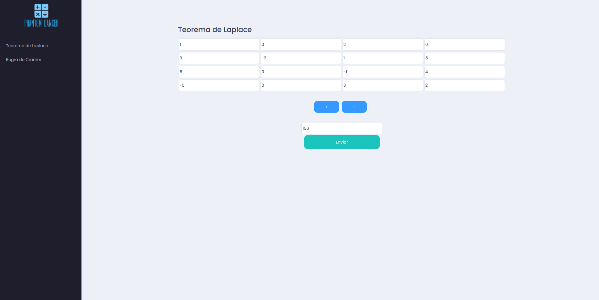
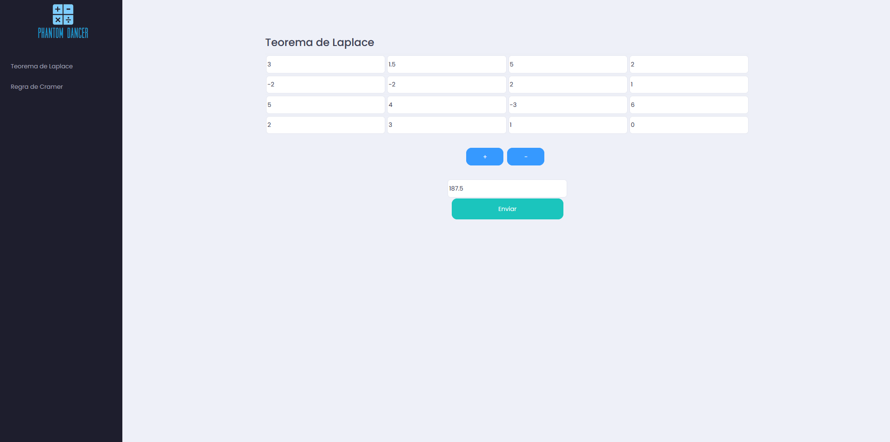
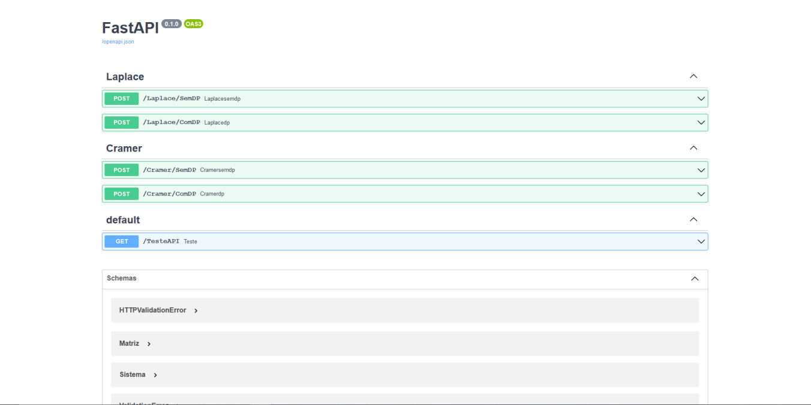

# Phantom Dancer

## Alunos

| Matrícula  | Aluno                            |
| ---------- | -------------------------------- |
| 18/0054082 | Marcelo Victor de Sousa Silva    |
| 18/0029223 | Washington Bispo Arishita Junior |

## Sobre 
Esse projeto tem como objetivo desenvolver uma calculadora que usufrui de DP para calcular o teorema de laplace ou a Regra de Cramer.

## Screenshots




## Instalação 
**Linguagem**: C#, JavaScript<br>
**Framework**: FastAPI<br>


## Uso
O BackEnd do projeto está no link <https://ynd8ax.deta.dev/docs> podendo também ser utilizado em sua maquina local da seguinte forma:.

1 - certifique-se de ter já instalado o python em seu sistema
2 - instale o pip
3 - e instale as dependências mostradas logo abaixo

```
pip install fastapi
pip install uvicorn[standard]
pip install numpy
```
4 - por fim rode o projeto

```
cd Back/
uvicorn main:app --reload
```

Após isso rode o Front da seguinte maneira:

1 - vá até a pasta do front

```
cd Front/
```

2 - Abra o index.html com seu navegador e pronto.

3 - Utilize a calculadora como é mostrado no vídeo ou utilize a partir do swagger presente no link do Back.

## Apresentação

O link da apresentação pode ser encontrado no seguinte link:

<https://www.youtube.com/watch?v=DWwQ2Pi3ga0>

e também na pasta raiz com o nome:

```
./Apresentacao_PD.mp4
```


